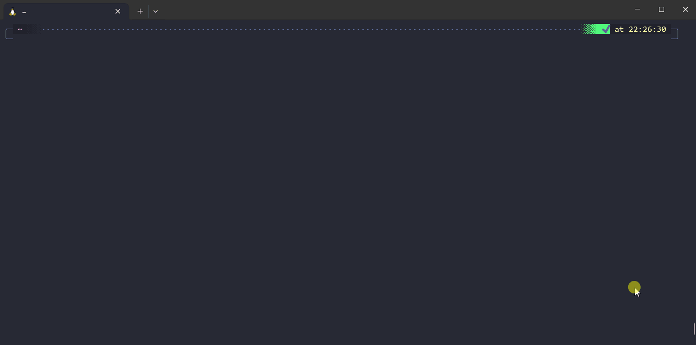
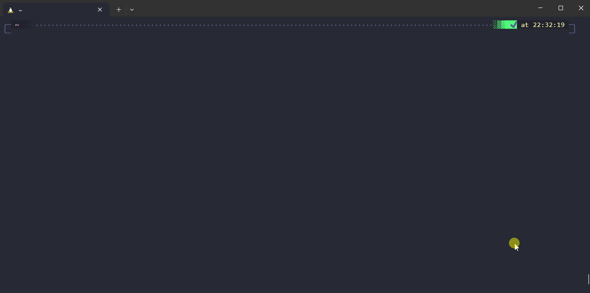
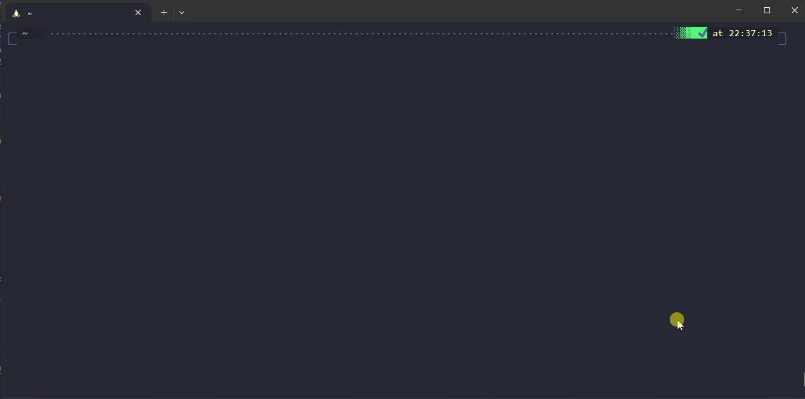
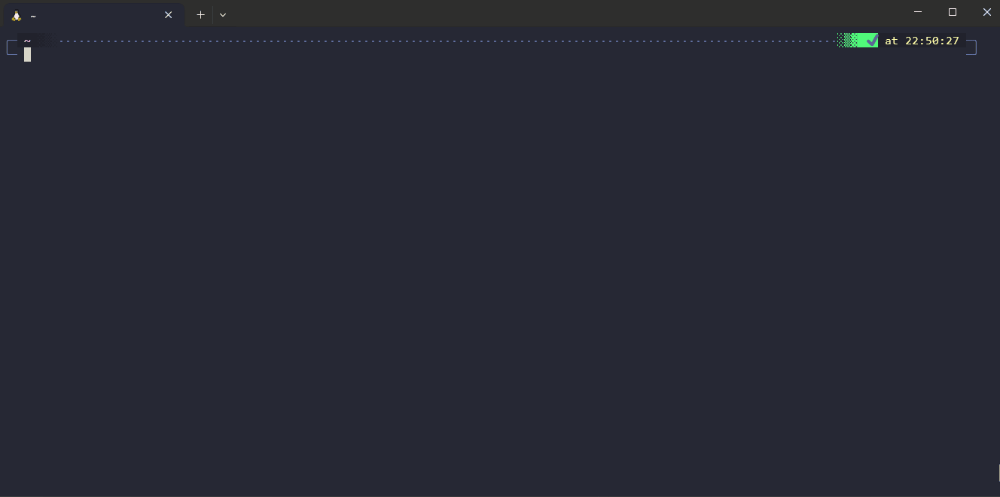
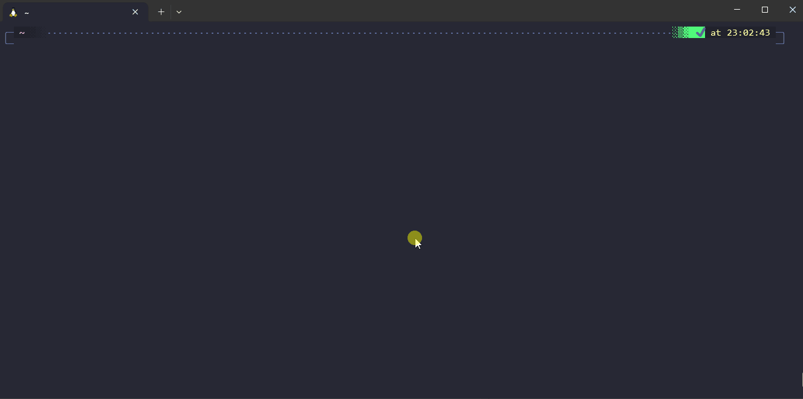
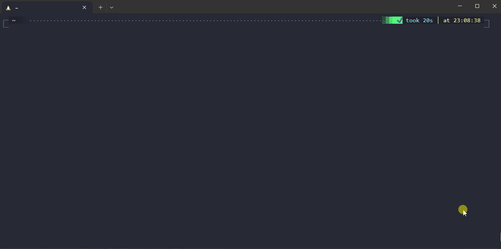

# ♣️ Valet

[][latest-release]
[][releases]
[][license]
[][bash]


Valet is a wrapper around your bash scripts that provides an interactive menu, standard help output, auto parsing for options and arguments, error handling, a framework for approval testing, execution profiling, and so on... It also doubles as a library from which you can easily import useful functions written in pure bash (faster and no dependencies!) to manipulate string, arrays or even display beautiful prompts to your users!

It works on **any Linux environment with bash** or on **Git bash for Windows**.

It is written for performance and to minimize the overhead of a script calling your scripts.

It is made for providing an awesome user experience in interactive mode, but it is also designed to make your scripts easy to use and debug in CI/CD pipelines; DevOps engineers should love it! 💖

**Table of contents**:

- [🤔 Use cases](#-use-cases)
- [✨ Features showcase](#-features-showcase)
- [🎉 Installation](#-installation)
  - [Dependencies](#dependencies)
  - [Automated installation](#automated-installation)
  - [Manual installation](#manual-installation)
  - [Manual installation from sources](#manual-installation-from-sources)
- [💻 Usage](#-usage)
  - [Adding your own commands](#adding-your-own-commands)
  - [Command menu](#command-menu)
  - [Interactive mode](#interactive-mode)
  - [Environments variables](#environments-variables)
- [🤝 Contributions](#-contributions)
- [🔭 Roadmap](#-roadmap)

---

## 🤔 Use cases

To help you on your daily tasks, you have created a collection of bash scripts that you added to your path.

But...

- You never recall what are the options and/or arguments of these scripts.
- You struggle to even remember how they are named and how to invoke them.
- They are not correctly documented.
- They all follow a different convention regarding options and arguments.
- You never implemented tests for your scripts because you don't know how to do that fast.

**→ This is where Valet can help you!**

## ✨ Features showcase

Valet in a gist:

- In Valet, you can create new **commands** that you can invoke with `valet my-command`.
- Each command has a definition with properties that help you describe it (a description, a list of arguments and options, and so on...).
- Each command has an associated bash function that is called when the command is invoked and which contains your logic.
- You define commands and their functions in `.sh` files under your Valet user directory and Valet takes care of indexing your commands; which allows you to quickly find them, parse options, arguments, print their help...

Invoking `valet` without arguments lets you interactively search and invoke commands:



With `valet command --help` or `valet help command`, you get a beautifully formatted help for your command usage:



Fuzzy matching command names allow you to invoke the right command more quickly, see this example with `valet h s h`:



Automate tests for your script with approval test approach:



Get beautiful logs fully customizable (with optional wrapping!):



Auto parsing of arguments and options based on your command configuration:



> [!NOTE]
> This showcase is recorded with the [windows terminal][windows-terminal], [debian on WSL][debian-wsl] with zsh & [oh my zsh][oh-my-zsh]. The color scheme for the terminal is [dracula][dracula-theme] and the font is a homemade modification of windows Consolas (with ligatures + with [nerd font icons][nerd-font]).

## 🎉 Installation

### Dependencies

- Bash version 5.2 or superior is required (might work with older versions but it is not guaranteed).
- From [GNU coreutils](https://www.gnu.org/software/coreutils/): it uses `rm`, `mv`, `mkdir` for all commands. It uses `chmod`, `ln` for the installation/updates.
- [curl][curl] and [tar][tar] are needed if you want to use the self-update command.

### Automated installation

Run the following command to install Valet:

```bash
bash -c "$(curl -fsSL https://raw.githubusercontent.com/jcaillon/valet/main/valet.d/commands.d/self-install.sh)"
```

> [!TIP]
> Please review the [installation script][install-script] to learn about the different installer options.

### Manual installation

1. Download the correct package (depends on your OS/cpu architecture) from the [latest release from GitHub][latest-release].
2. Extract the archive to your favorite installation directory.
3. Add this directory to your PATH (or link Valet to `/usr/local/bin`) so you can call `valet` from your terminal.
4. Call `valet` to get started with the example commands!

> [!NOTE]
> The `valet-no-binaries.tar.gz` package does not pack the dependencies binaries. You will need to have them in your PATH.

### Manual installation from sources

1. You can then clone this project or download the source from the latest release into the directory of your choice.
2. Add this directory to your PATH (or link Valet to `/usr/local/bin`) so you can call `valet` from your terminal.
3. Call `valet` to get started with the example commands!

## 💻 Usage

### Adding your own commands

Valet is pre-configured with some example commands so you can try it immediately and see how it feels.

However, the main goal is to create your own commands and add them in Valet. Valet takes care of the boilerplate stuff (parsing arguments, proper log functions, help, testing your command...) so you can focus on the feature of your command.

To create a new command, follow this [documentation][new-command].

### Command menu

Calling `valet` without any arguments (you can pass options) will open the interactive search for commands.

Type your query (fuzzy matching is active so you can skip some letters), press ⬇️/⬆️ to select the command and hit enter to run it. Press `ALT+H` to show the help text for interactive mode.

Valet will remember your last choices, and they will appear at the top of the list the next time the menu shows up. You can set up how many choices to remember with the variable `VALET_CONFIG_REMEMBER_LAST_CHOICES`. Setting `VALET_CONFIG_REMEMBER_LAST_CHOICES=0` will effectively disable this feature and always display items sorted alphabetically.

### Interactive mode

Calling any command that requires arguments without arguments will start the interactive mode and prompt you for the required values.

You can force entering the interactive mode with the Valet option `-i`, e.g. `valet -i my command`.

### Environments variables

Most (all?) options in Valet are configurable with environment variables. Even options that you can pass to your custom commands can be set through variables (check the `--help`)!

This makes Valet particularly suitable for automation (in CI/CD pipelines for instance).

## 🤝 Contributions

Please check the [CONTRIBUTING.md][contributing] documentation if you intend to work on this project.

## 🔭 Roadmap

- rename CMD_ variables.
- Document everything. Document test.
- Add full support for interactive mode.
- For dropdown with a set list of options, we can verify that the input value is one of the expected value.
- Generate an autocompletion script for bash and zsh.
- Self-command to create a new command interactively.
- We can have fuzzy matching on options too; just make sure it is not ambiguous.
- Create a valet-community-commands where everyone can contribute to new default commands for Valet.
- Optional strict mode (env var) to disable fuzzy matching (to not mistakenly execute a command on ci for instance).
- head / tail from file.
- Allow to regroup single letter options (e.g. -fsSL).
- Add a command self package that build the user commands into a single script file.
- fix running tests with verbose mode on.
- Replace awk with bash.
- Provide an alternative bash function if diff is not found.
- Allow to separate commands from options/arguments with `--`.
- Have a consistent look and feel for interactive functions.
- Reimplement usage of main::sortCommands / main::addLastChoice.
- Add a default value for options.
- Implement regex replace in pure bash.
- Show the arguments required when a command parsing fails.
- Betters checks in self build!
- Support alternative single comments `# ## VALET COMMAND` instead of multiline comments for command declaration (see we can have help in autocompletion).
- A command can declare dependencies to auto check if some tools are installed before running the command.
- Generate vscode snippets from each function in core and lib-* to provide autocompletion for users.
- Try to add a variable that allows to output the logs to a given file in addition to &2 and we generate a unique file for each time valet is run.

[releases]: https://github.com/jcaillon/valet/releases
[latest-release]: https://github.com/jcaillon/valet/releases/latest
[new-command]: docs/create-new-command.md
[install-script]: ./valet.d/commands.d/self-install.sh
[license]: ./LICENSE
[contributing]: CONTRIBUTING.md
[bash]: https://www.gnu.org/software/bash/
[nerd-font]: https://www.nerdfonts.com/
[windows-terminal]: https://github.com/microsoft/terminal
[debian-wsl]: https://wiki.debian.org/InstallingDebianOn/Microsoft/Windows/SubsystemForLinux
[oh-my-zsh]: https://ohmyz.sh/
[dracula-theme]: https://draculatheme.com/windows-terminal
[curl]: https://curl.se/
[tar]: https://www.gnu.org/software/tar/
