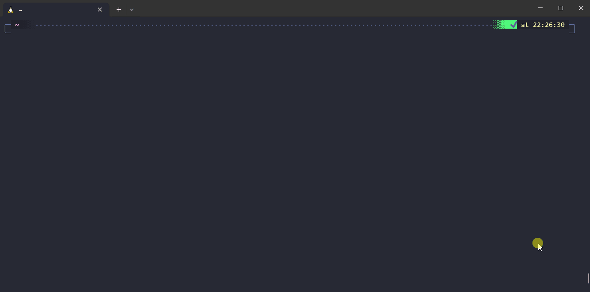
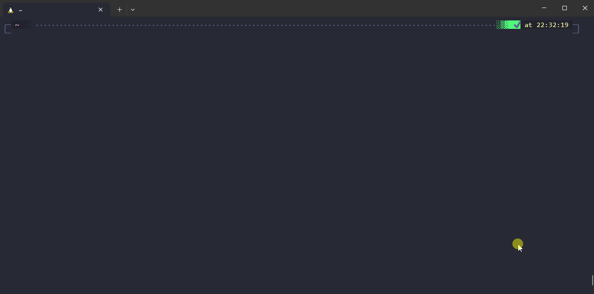
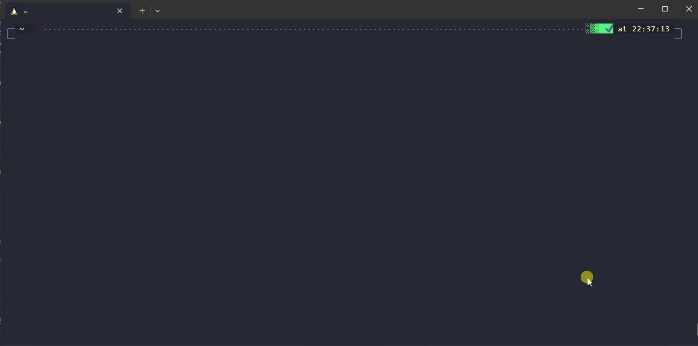
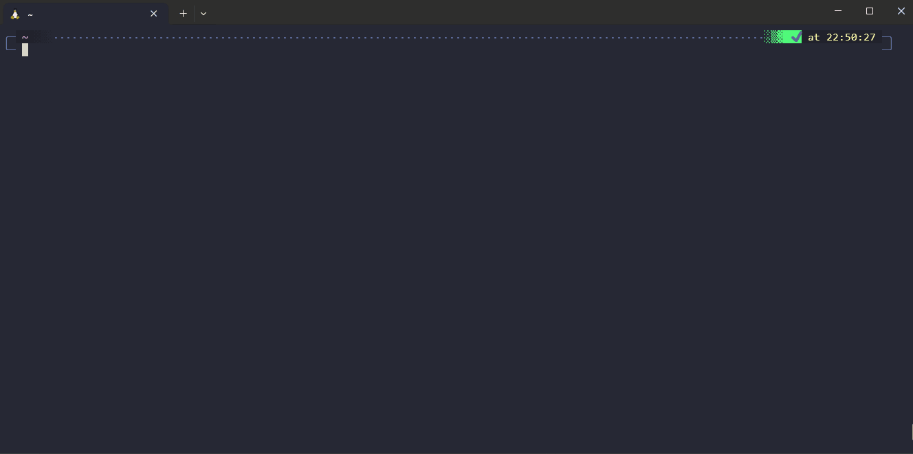
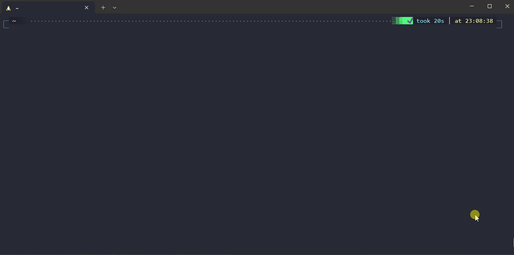

# Valet

[](https://github.com/jcaillon/3P/releases/latest)

⚠️ THIS IS A WORK IN PROGRESS, PLEASE WAIT FOR THE REMOVAL OF THIS DISCLAIMER :)

Valet is a wrapper around your bash scripts that provides an interactive menu, standard help output, auto parsing for options and arguments, error handling, a framework for approval testing, and so on...

It works on **any Linux environment with bash** or on **Git bash for Windows**.

It is written for performance and to minimize the overhead of a script calling your scripts.

It is made for providing an awesome user experience in interactive mode but it is also designed to make your scripts easy to use and debug in CI/CD pipelines; DevOps engineers should love it! 💖


## Use case

To help you on your daily tasks, you have created a collection of bash scripts that you added to your path.

But...

- You never recall what are the options and/or arguments of these scripts.
- You struggle to even remember how they are named and how to invoke them.
- They are not correctly documented.
- They all follow a different convention regarding options and arguments.
- You never implemented tests for your scripts because you don't known how to do that fast.

**→ This is where Valet can help you!**

## Features showcase

Valet in a gist:

- In Valet, you can create new **commands** that you can invoke with `valet my-command`.
- Each command has properties that help you describe it (a description, a list of arguments and options, and so on...).
- Each command has a associated bash function that is called when the command is invoked and which contains your logic.
- You define commands and their functions in `.sh` files under your Valet user directory and Valet takes care of indexing your commands; which allows you to quickly find them, parse options, arguments, print their help...

Invoking `valet` without arguments lets you interactively search and invoke commands:



With `valet command --help` or `valet help command`, you get a beautifully formatted help for your command usage:



Fuzzy matching command names allow you to invoke the right command more quickly, see this example with `valet h s h`:



Automate tests for your script with approval test approach:



Beautiful logs fully customizable:


Automated parsing of arguments and options based on your command configuration:



> [!NOTE]
> This showcase is recorded with the [windows terminal](https://github.com/microsoft/terminal), [debian on WSL](https://wiki.debian.org/InstallingDebianOn/Microsoft/Windows/SubsystemForLinux) with zsh & [oh my zsh](https://ohmyz.sh/).
> The color scheme for the terminal is [dracula](https://draculatheme.com/windows-terminal) and the font is an home made modification of windows consolas ligaturized and with nerd font icons.

## Installation

You need bash version 5 or higher to be installed on your machine to run Valet.

### Automated installation

Run the following command to install Valet:

```bash
curl https://github.com/jcaillon/valet | bash
```

> [!NOTE]
> The automated installation downloads [fzf][fzf] and [yq][yq] in the Valet `bin` sub directory.
>
> It also copies the [examples.d](examples.d) directory to your Valet user directory (if empty) and runs `valet self build` in order to get you started.

### Manual installation

1. You need the following tools installed and present in your PATH for valet to work:
   1. [yq][yq] (to be able to build your commands)
   2. [fzf][fzf] (to have the interactive mode/menu)
2. You can then git clone this project or download the source from the latest release into the directory of your choice.
3. Add this directory to your PATH (or link Valet to `/usr/local/bin`) so you can call `valet` from your terminal.
4. Call `valet` to get started with the example commands!

## Usage

> [!IMPORTANT]
> If you see the replacement character � in my terminal, it means you don't have a [nerd font][nerd-font] setup in your terminal.
>
> Either install a nerd font and activate it on our terminal or `export VALET_NO_ICON=true` in your environment.

### Adding your own commands

Valet is pre-configured with some example commands so you can try it immediately and see how it feels.

However, the main goal is to create your own commands and add them in Valet. Valet takes care of the boiler plate stuff (parsing arguments, proper log functions, help, testing your command...) so you can focus on the feature of your command.

To create a new command, follow this [documentation][new-command].

### Command menu

Calling `valet` without any arguments (you can pass options) will open the interactive search for commands.

Type your query (fuzzy matching is active so you can skip some letters), press ⬇️/⬆️ to select the command and hit enter to run it.

Valet will remember your choice so they it appear at the top of the list the next time the menu shows up. You can set up how many choices to remember with the variable `VALET_REMEMBER_LAST_CHOICES`. Setting `VALET_REMEMBER_LAST_CHOICES=0` will effectively disable this feature and always display items sorted alphabetically.

### Interactive mode

Calling any command that requires arguments without arguments will start the interactive mode and prompt you for the required values.

You can force entering the interactive mode with the Valet option `-i`, e.g. `valet -i my command`.

### Environments variables

Most (all?) options in Valet are configurable with environment variables. Even options that you can pass to your custom commands can be set through variables (check the `--help`)!

This makes Valet particularly suitable for automation (in CI/CD pipelines for instance).

## Contributions

Please check the [CONTRIBUTING.md](CONTRIBUTING.md) documentation if you intend to work on this project.

## Roadmap

- Installation and self update script.
- Add support for interactive mode.
- For dropdown with a set list of options, we can verify that the input value is one of the expected value.
- Setup github actions to automatically test Valet.
- Generate an autocompletion script for bash and zsh.
- Self command to create a new command interactively.
- Get rid of yq dependency in self build.
- Replace fzf menu with equivalent pure bash menu.
- Allow fileToSource to have multiple values separated by a comma (so we can load libraries of functions).
- Add about option to hide the command in the menus.
- Add tests for self build.
- Implement self release command to tag and push to github.

[fzf]: https://github.com/junegunn/fzf
[yq]: https://github.com/mikefarah/yq
[nerd-font]: https://www.nerdfonts.com/
[new-command]: docs/create-new-command.md
