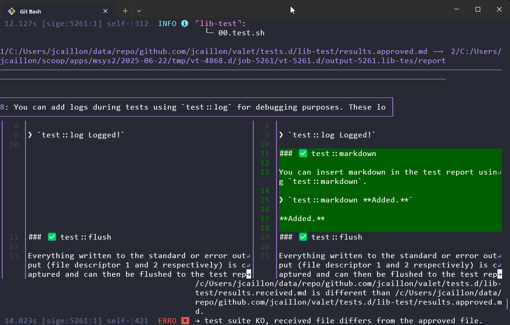

Valet comes with a standardized way to implement and run tests for your commands and library functions.

Once you have [created an extension][newExtensionsLink] and moved to its directory, you can start creating your new tests.

## 📂 Test suites and test files

Tests are organized in thematic groups which are called **test suites**. A test suite is a directory which contains **test scripts**. All test suite directories should be created in the `tests.d` directory in your extension.

A test suite can, for example, regroup tests for a particular command. Organize them as you please. You can even define a single test suite for all your tests.

> [!TIP]
> Test suites are run in parallel, test scripts inside a test suite are run sequentially.

The tests are coded in `.sh` scripts directly under a test suite directory.

You can check the [test suites defined for Valet][valet-test-suites] to have an example.

Here is an example of directory structure for your user directory:


  
    
      
        
          
        
      
    
    
      
        
        
          
        
      
    
    
      
        
        
          
        
      
    
  


## ✅ Approval testing

In your test scripts, you will call your command functions or run any code that you wish to test. However, you will not directly do assertions like in other test frameworks (e.g. you will not do something like `assert.equal (true, true);`).

Instead:

1. You will just print what you want to the stdout (e.g. `echo stuff`) or stderr (e.g. `echo thing >&2`) file descriptors.
2. These outputs will be captured, formatted, and appended to a test report file named `results.received.md`.
3. This file will then be compared to an existing file named `results.approved.md` which is supposed to be committed with your sources and which contains the expected test report.
4. If the files are different but the new received test if correct (or if the approved version does not exist yet), you can approve it and `results.received.md` will be the new `results.approved.md`.
5. When you run the test again, the 2 files will be identical, ensuring you that your tests still lead to the same results.

You can check an example of test report for the [test library of Valet][valet-test-lib-report].

Each test suite will generate a different test results markdown file that can be approved.

> [!TIP]
> Valet uses a diff tool to compare the received and the approved files. It is strongly recommended to install [delta](https://github.com/dandavison/delta) which will automatically be used by Valet. You can configure your diff tool in the [Valet config](../configuration/).
>
> Valet will use a pure bash file compare function if it doesn't find a better diff tool, but the experience will be suboptimal.

{}



{}

## 🧪 Tests

Tests are implemented in `.sh` scripts directly under a test suite directory. The name of the script will determine the `h2` header of the report file while the name of the test suite directory will determine the `h1` header. You can have several scripts or one script per test suite.

## ✒️ Implement tests

Here is a very simple example of script to test a command function `myCommand`:

```bash {linenos=table,linenostart=1,filename="test.sh"}
#!/usr/bin/env bash
test::exec myCommand
```

This assumes that `myCommand` will print logs or something to the stdout/stderr, in which case the function output will appear in the test report.

In addition `test::exec`, you have access to many functions that you can use in your test scripts to build up the report file: [libraries/test][libraries-tests].

You are advised to check the tests for the test library, which also documents how to use each function:

- [The test report generated][valet-test-lib-report].
- [The test script][valet-test-lib-tests].

The Valet [tests.d][valet-test-suites] directory contains many other examples.

## 🏃‍♂️ Run tests

You can run all your tests with:

```bash
valet self test
```

If you change your code or add new tests, you will have to approve the test results. While you can do it manually by copying files, it is recommended to _auto-approve_ the results and then use `git diff` to review the changes. You can auto-approve all test results by using the `-a` option:

```bash
valet self test -a
```

Once you have validated the approved version, you can commit it. Or revert to the HEAD version if something went wrong.

You can also exclude or include test suite using `-i` and `-e` options (check `valet self test -h` for more). E.g.:

```bash
valet self test -i my-test-suite
```

> [!NOTE]
> Some additional information about the test execution:
>
> - Each test suite is executed in a separate subshell.
> - Each test script is executed in a separate subshell (within the subshell of the test suite).
>
> This allow you to modify the shell as you wish in the hooks and test implementation without impacting the other tests.

## 🪝 Test hooks

In addition to the test scripts, you can create other specific scripts which will be included (`source`) at different time during the tests execution:

| Script path | Purpose |
|-------------|---------|
| `tests.d/before-tests` | Included before each test suite is executed. |
| `tests.d/after-tests` | Included after each test suite is executed. |

[valet-test-suites]: https://github.com/jcaillon/valet/tree/latest/tests.d
[valet-test-lib-report]: https://github.com/jcaillon/valet/blob/latest/tests.d/lib-test/results.approved.md
[valet-test-lib-tests]: https://github.com/jcaillon/valet/blob/latest/tests.d/lib-test/00.tests.sh
[libraries-tests]: ../libraries/test
[newExtensionsLink]: ../new-extensions


