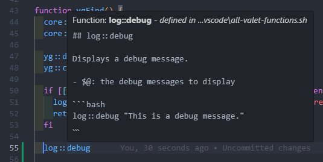

> [!INFORMATION]
> Disclaimer: This page is just one opinion. This is not the best way to work on bash scripts, this is just an explanation of how I work.

## IDE

I work with VS code on windows + WSL.

Install VS code from [here](https://code.visualstudio.com/download).

## VS code extensions

Here is a list of recommended extensions to work on bash scripts:

- [Bash IDE](https://marketplace.visualstudio.com/items?itemName=mads-hartmann.bash-ide-vscode)
- [Debug bash scripts](https://marketplace.visualstudio.com/items?itemName=rogalmic.bash-debug)
- [Shell Script Command Completion](https://marketplace.visualstudio.com/items?itemName=tetradresearch.vscode-h2o)
- [Better comments](https://marketplace.visualstudio.com/items?itemName=aaron-bond.better-comments)
- [Better shellscript syntax](https://marketplace.visualstudio.com/items?itemName=jeff-hykin.better-shellscript-syntax)
- [Code spell checker](https://marketplace.visualstudio.com/items?itemName=streetsidesoftware.code-spell-checker)
- [EditorConfig](https://marketplace.visualstudio.com/items?itemName=EditorConfig.EditorConfig)
- [Indent rainbow](https://marketplace.visualstudio.com/items?itemName=oderwat.indent-rainbow)
- [Format shell script](https://marketplace.visualstudio.com/items?itemName=foxundermoon.shell-format)
- [Shellcheck](https://marketplace.visualstudio.com/items?itemName=timonwong.shellcheck)
- [Snippets manager](https://marketplace.visualstudio.com/items?itemName=zjffun.snippetsmanager)
- [Snippets for bash scripts](https://marketplace.visualstudio.com/items?itemName=Remisa.shellman)
- [Snippets for shebang](https://marketplace.visualstudio.com/items?itemName=rpinski.shebang-snippets)

GitHub Copilot is of great help if you can have it. You can also find the list of [extensions here](https://github.com/jcaillon/valet/blob/main/.vscode/extensions.json).

## VS code settings

You can open your `~/.valet.d` directory as a workspace on vscode.

I recommend to copy (or link) the [extras/all-valet-functions.sh](https://github.com/jcaillon/valet/blob/main/extras/all-valet-functions.sh) file present in the Valet installation to `~/.valet.d/.vscode/all-valet-functions.sh` in your workspace folder and add the following settings in your `~/.valet.d/.vscode/settings.json`:

```json
{
  "bashIde.includeAllWorkspaceSymbols": true
}
```

This allows you to have autocompletion and help on the core and libraries functions:



Alternatively, you can use the Valet [vscode snippets](https://github.com/jcaillon/valet/edit/main/extras/valet.code-snippets):

- copy this file in your repository under the `.vscode` directory (you can chose to ignore this in git or push it).
- or copy this file as `shellscript.json` in your user snippets folder (`%APPDATA%\Code\User\snippets` in windows).


This is done for you if you use the automated installer of Valet.


## Where to start your bash journey

- [The official bash documentation](https://www.gnu.org/software/bash/manual/bash.html) / [Alternate view on devdocs.io](https://devdocs.io/bash/)
- [Advanced bash scripting guide](https://tldp.org/LDP/abs/html/index.html)
- [Google shell style guidelines](https://google.github.io/styleguide/shellguide.html)
- [Baeldung Linux scripting series](https://www.baeldung.com/linux/linux-scripting-series)
- [Pure bash bible](https://github.com/dylanaraps/pure-bash-bible)


  
  

