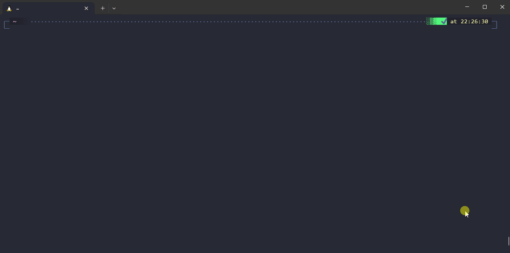
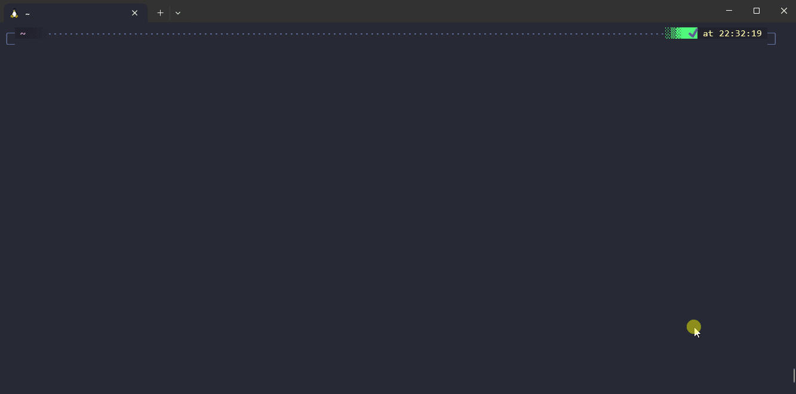
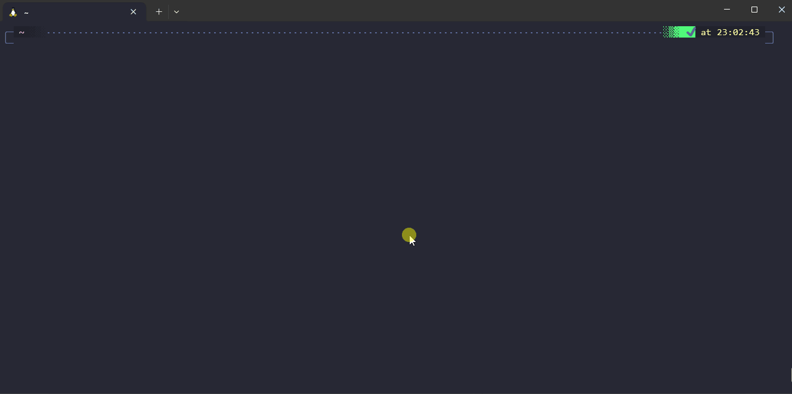
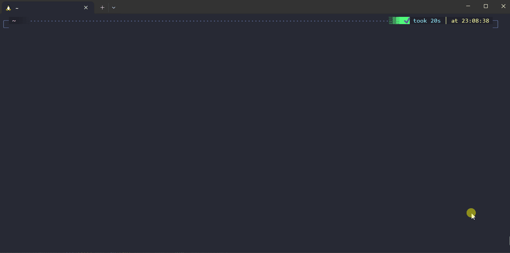

Valet in a gist:

- In Valet, you can create new **commands** that you can invoke with `valet my-command`.
- Each command has properties that describe it (a description, a list of arguments and options, and so on...).
- Each command has an associated bash function that is called when the command is invoked and which contains your logic.
- You define commands and their functions in `.sh` files under your Valet user directory and Valet takes care of indexing your commands; which allows you to quickly find them, parse options, arguments, print their help...

## 🖥️ An interactive menu

Invoking `valet` without arguments lets you interactively search and invoke commands:



## 📖 Clear and standardized help

With `valet command --help` or `valet help command`, you get a beautifully formatted help for your command usage:



Fuzzy matching command names allow you to invoke the right command more quickly, see this example with `valet h s h`:

## 🔎 Fuzzy matching


## 🧪 Test framework

Automate tests for your script with approval test approach:


## 🐾 Logging library

Get beautiful logs fully customizable (with optional wrapping!):



## 🪄 Auto parser

Auto parsing of arguments and options based on your command configuration:



## 🧩 Libraries of function

Make your scripts more performant and write code faster by using Valet [libraries][libraries-link] for string manipulation, interactive prompt, pure bash I/O and more... Some examples:

```python {linenos=table,linenostart=1,filename="script.sh"}
myFunction() {
  source string
  string::cutField "field1 field2 field3" 1 " " && echo "The field at index 1 is ${RETURNED_VALUE}"
  string::extractBetween "<html><b>Bold value</b></html>" "<b>" "</b>" && echo "The extracted value is ${RETURNED_VALUE}" 

  source interactive
  if interactive::promptYesNo "Do you want to continue?"; then echo "Yes."; else echo "No."; fi
}
```


This showcase was recorded with the [windows terminal][windows-terminal], [debian on WSL][debian-wsl] with zsh & [oh my zsh][oh-my-zsh]. The color scheme for the terminal is [dracula][dracula-theme] and the font is a homemade modification of windows Consolas (with ligatures + with nerd font icons).

[windows-terminal]: https://github.com/microsoft/terminal
[debian-wsl]: https://wiki.debian.org/InstallingDebianOn/Microsoft/Windows/SubsystemForLinux
[oh-my-zsh]: https://ohmyz.sh/
[dracula-theme]: https://draculatheme.com/windows-terminal



  


[libraries-link]: ../docs/libraries/